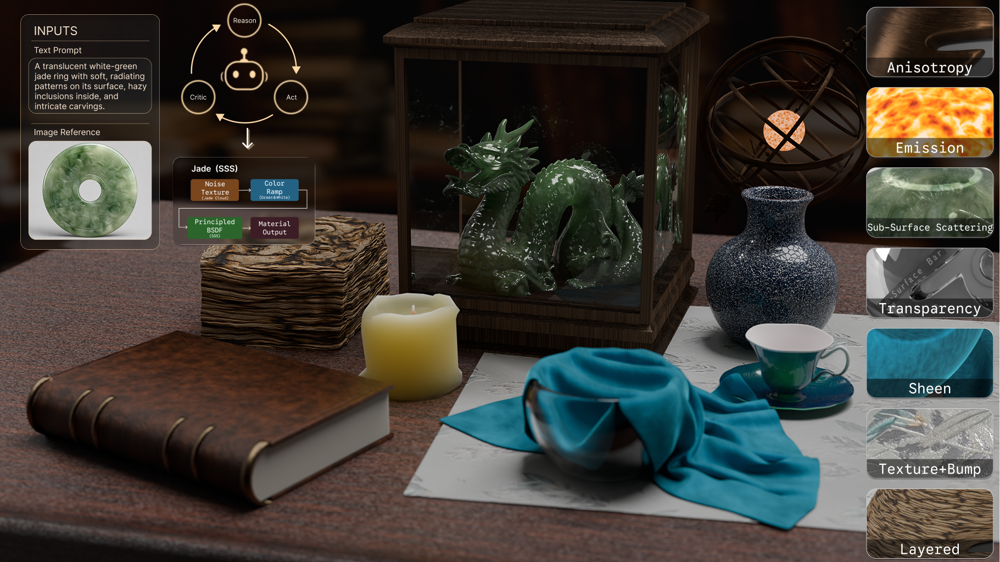
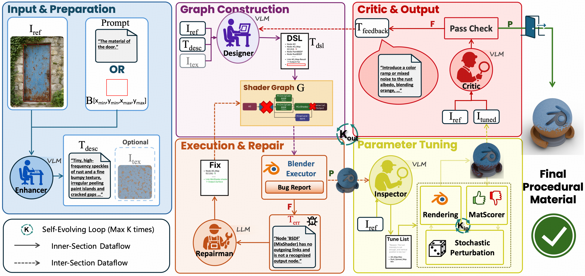

<p align="center">
  
</p>

# ShaderAgent: Self-Evolving Agentic Procedural Material Generation

<div align="center">

[-green.svg)](https://github.com/VAST-AI-Research/ShaderAgent/releases/latest/download/ShaderAgent.pdf)
[](https://doi.org/10.1145/3829340.3842164)
[](https://huggingface.co/yuanze1024/ShaderAgent-MatScorer-Qwen3VLReranker-LoRA)
[](https://huggingface.co/datasets/yuanze1024/ShaderAgent-MatScorer-Data)

</div>

ShaderAgent turns a reference photo into an **editable Blender procedural material** — a node
graph you can open and tweak, not a baked texture. A Designer LLM writes a shader-graph DSL,
Cycles renders it, a fine-tuned VLM scorer (MatScorer) drives numeric parameter search, and a
VLM Critic decides whether to keep the result.

<p align="center">
  
</p>

1. **Classifier** routes the material down a procedural or a texture-map branch.
2. **Designer** writes a node graph in a compact shader DSL, validated before it ever reaches Blender.
3. **Cycles** renders the graph on three canonical views (`plane`, `bright_ball`, `dark_ball`).
4. **MatScorer**, a LoRA on Qwen3-VL-Reranker-8B, scores candidates against the marked reference region and drives numeric parameter search.
5. **Critic** grades the winner on a rubric, then either accepts it or sends the Designer back for a structure rewrite.

## What's in this repo

- The runtime: pipeline, the four agents, the shader DSL (parse / validate / `to_bpy`), and the Cycles renderer.
- Two material-preview scenes (`data/agent_ball.blend`, `data/agent_plane.blend`) and one AI-generated example image (`data/xmas.png`).
- A stdio MCP server exposing `validate_dsl` and `render_dsl` to any MCP client.

The MatScorer weights and the data they were trained on are released separately, on Hugging
Face — see [Models and data](#models-and-data).

## Requirements

- Python 3.10+
- NVIDIA GPU — Cycles renders on CUDA, or OptiX if the driver provides it
- Blender 4.1+ on `PATH`, or set `blender.executable_path` in the YAML
- A vision-capable chat endpoint ([Keys and endpoints](#keys-and-endpoints))

## Install

A source checkout, not a PyPI package:

```bash
git clone https://github.com/VAST-AI-Research/ShaderAgent.git
cd ShaderAgent
pip install -r requirements.txt
export PYTHONPATH=src
```

Run everything from the repository root, so the paths in `data/` resolve.

## Quick start

```bash
export OPENAI_API_KEY=...
export PYTHONPATH=src

python -m shader_agent \
  --config config/default.yaml \
  --image data/xmas.png \
  --text "The wrapper of the present box." \
  --output outputs/xmas
```

Success leaves `outputs/xmas/` holding `*_best.py` (a runnable Blender script), `*_best.dsl`
(the graph), the final PNG, and `usage.json` (token and cost accounting).

Over a JSONL index:

```bash
python -m shader_agent.batch --config config/default.yaml --tag outputs/demo --limit 1
```

## What to expect

| | What to plan for |
|---|---|
| Work per material | up to 3 trials × 3 structure steps, 50 tuning iterations each (defaults) |
| GPU | one render at a time by default; each concurrent Blender holds its own VRAM |
| API cost | every run writes `usage.json` — read it before launching a batch |
| Paper numbers | produced with **Gemini 3.1 Pro Preview**; the default config ships **gpt-6-astra**, which gives substantially better materials in our runs, so output here will not match the paper line-for-line |

Model ids are whatever your endpoint serves — edit `models.*.model_id` and `api_base` in the YAML.

## Models and data

Parameter search loads the base reranker plus the MatScorer LoRA. Both default configs already
point at it, and both download on first use:

```yaml
image_metrics:
  model_path: Qwen/Qwen3-VL-Reranker-8B
  adapter_path: yuanze1024/ShaderAgent-MatScorer-Qwen3VLReranker-LoRA
```

| Artifact | Size | Link |
|---|---|---|
| MatScorer LoRA | 42 MB | [yuanze1024/ShaderAgent-MatScorer-Qwen3VLReranker-LoRA](https://huggingface.co/yuanze1024/ShaderAgent-MatScorer-Qwen3VLReranker-LoRA) |
| Training + evaluation data | 42 GiB | [yuanze1024/ShaderAgent-MatScorer-Data](https://huggingface.co/datasets/yuanze1024/ShaderAgent-MatScorer-Data) |

`adapter_path: null` runs the base reranker instead — search still works, it just scores worse.
The dataset ships a `viewer.html` for browsing the annotations without pulling the images, and
`allow_patterns` in its card shows how to fetch one config instead of all 42 GiB.

MatScorer is a LoRA (rank 8, alpha 32, dropout 0.05) on the language-model projections of
Qwen3-VL-Reranker-8B, scoring a candidate as `sigmoid((W_yes - W_no) · h_last)` and trained with a
listwise InfoNCE objective over one positive and N negatives per group: first on the synthetic
split, then on the human-labelled pairs. The model card states the recipe in full, and the dataset
card documents the record format, so the scorer can be retrained from the released artifacts.

The base model is Apache-2.0, but the LoRA was trained on data mixing several upstream licenses,
so **the weights and the data are for research / non-commercial use**. The dataset's
[NOTICE](https://huggingface.co/datasets/yuanze1024/ShaderAgent-MatScorer-Data/blob/main/NOTICE)
gives the terms per directory.

## Keys and endpoints

Two wire formats, two environment variables. YAML never holds a key — export it in the shell,
since the process reads `os.environ` and does not load a `.env` file.

| Config | Chat | Texture maps | Env |
|---|---|---|---|
| `config/default.yaml` | `gpt-6-astra` (Chat Completions) | `gpt-image-2.5-flare` (Images API) | `OPENAI_API_KEY` |
| `config/default-claude.yaml` | `claude-opus-5` (Messages) | `gemini-3.1-flash-image-preview` | `ANTHROPIC_API_KEY`, plus `GOOGLE_API_KEY` on the texture route |

Anthropic serves no image model, so the Claude config generates texture maps with Gemini. The
procedural route never calls it; only a material the Classifier sends down the texture branch does.

For a proxy or gateway, use the OpenAI-style row: put its key in `OPENAI_API_KEY` and point
`api_base` at its `/v1`.

<details>
<summary><b>Tuning knobs and concurrency</b></summary>

Everything except the two concurrency caps lives in the YAML:

| Key | Meaning |
|---|---|
| `pipeline.max_trials` | whole-pipeline retries after a failed trial |
| `pipeline.max_steps` | Designer structure rewrites per trial |
| `param_tuning.max_iter` | numeric search steps per structure step |
| `critic.good_enough_min` | the winner must clear this on every rubric dimension to stop early |
| `scene.render_mode` | the saved hero view; the tuner also renders `plane` and `dark_ball` for MatScorer, while the Critic sees only `bright_ball` |

Two environment variables bound how many Blender processes run at once. Raise them only if the
GPU has headroom, since each concurrent render holds its own VRAM:

| Variable | Default | Effect |
|---|---|---|
| `SHADER_PIPELINE_SCENE_MAX_CONCURRENT` | `1` | one-shot Cycles renders in flight across the process |
| `SHADER_PIPELINE_TUNING_MAX_CONCURRENT` | `3` | parameter-tuning rounds in flight; each spins up a pool of warm Blender daemons |

With `pipeline.dataset_workers > 1` and parameter tuning on, these are what keep the GPU from
running out of memory.

`compute_device_type` is `CUDA` or `OPTIX`. To confirm the GPU is really doing the work, check
that blender shows up in `nvidia-smi --query-compute-apps=pid,used_memory --format=csv`, or that
the Blender child process CPU time is far below wall time.

</details>

## DSL and MCP

The two tools the pipeline is built on are importable, and exposed over MCP:

```python
from shader_agent.tools import validate_dsl, render_dsl

print(validate_dsl("node BSDF ShaderNodeBsdfPrincipled\nnode Output ShaderNodeOutputMaterial\nlink BSDF.BSDF -> Output.Surface\n"))
render_dsl(open("outputs/xmas/xmas_best.dsl").read(), "outputs/plane.png", render_mode="plane")
```

```bash
python -m shader_agent.mcp    # stdio MCP: validate_dsl, render_dsl
```

<details>
<summary><b>MCP client config</b></summary>

```json
{
  "mcpServers": {
    "shader-agent": {
      "command": "python",
      "args": ["-m", "shader_agent.mcp"],
      "cwd": "/path/to/this/repo",
      "env": { "PYTHONPATH": "src" }
    }
  }
}
```

</details>

## Citation

```bibtex
@inproceedings{yuan2026shaderagent,
  title     = {ShaderAgent: Self-Evolving Agentic Procedural Material Generation},
  author    = {Yuan, Ze and Chen, Chia-hao and Zhang, Yuqing and Cao, Yan-Pei and Liang, Ding and Qi, Xiaojuan},
  booktitle = {SIGGRAPH Asia 2026 Conference Papers},
  year      = {2026},
  publisher = {ACM},
  doi       = {10.1145/3829340.3842164}
}
```

## Acknowledgements

The parameter-search design was inspired by [VLMaterial](https://github.com/mit-gfx/VLMaterial).
MatScorer builds on [Qwen3-VL-Reranker-8B](https://huggingface.co/Qwen/Qwen3-VL-Reranker-8B), and
its training data draws on [BlenderKit](https://www.blenderkit.com/),
[MatSynth](https://huggingface.co/datasets/gvecchio/MatSynth) and
[Tencent Hunyuan 3D](https://github.com/Tencent-Hunyuan/Hunyuan3D-2.1). The preview scenes are
modified from [b.m.p.s.](https://blenderartists.org/t/b-m-p-s-1-5/443716) by Robin Marín.

## License

Code is [MIT](LICENSE). The two preview scenes under `data/` are CC BY-NC-SA 3.0 and are **not**
covered by it — nothing in the pipeline depends on them, so for commercial work point
`blender.scene.blend_file` at your own `.blend` and set `scene.part_name` to its object name.
The MatScorer weights and data carry their own research/non-commercial terms. Per-file details
and upstream attribution: [NOTICE](NOTICE).
